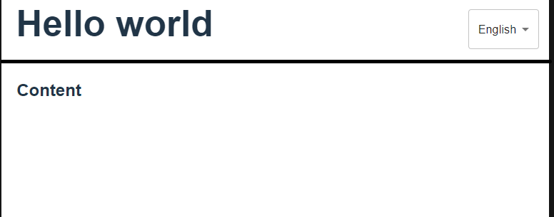

Задачи
1. Позиционирование элементов в комопненте header

Можно использовать установленный mui или выбрать чтото другое.


2. Создать кастомный хук useLocale который будет отвечать в приложении за перевод

  const { currentLang, t, allLang, onChangeLang } = useLocales();

  Таким образом в компонентах не будем дублировать код
  ```
    import { useTranslation } from "react-i18next";
    import { NAMESPACE } from "../../locales/config";

    const Comp = () => {
        const { t } = useTranslation(NAMESPACE);
    }
  ```

3. Добавить возможность задания динамических аргументов в перевод
```
en.json

{ "welcomeTo": "Welcome @name" }

.tsx
t('welcomeTo', { name: 'World' })

```

4. Реализовать форму приветствия, чтобы проверить задачу 3

<form>
    <p>Введите ваше имя?</p>
    <input name/>
    <button>Подтвердить</button>
</form>

alert(t('welcome', { name: form.name }))

5. Форма должна открываться при загрузке страницы и введенное имя должно отобразиться в header рядом слева от контрола выбора языка.


